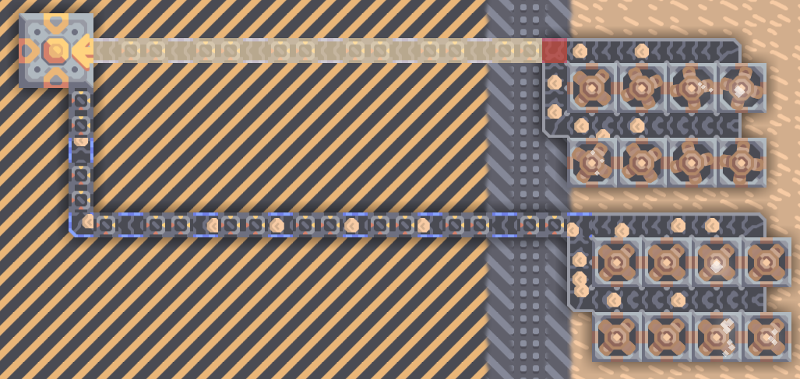

### [简体中文](#简体中文) | [English](#English)

# 简体中文

## 连接器辅助
* 允许连接器寻路
* 在传送带和连接器间替换成廉价的光传器件，可节省资源



## 辅助开关
可在 ```设置 -> 游戏 -> 连接器辅助``` 随时开关

# English

## Junction Assistant
* Allow diagonal junction.
* Replace conveyor and junction with cheaper instant transfer to save some resource.


## Setting
```Settings -> Game -> Junction Assistant``` to switch on or off anytime.